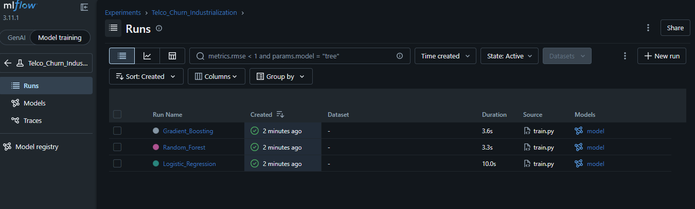
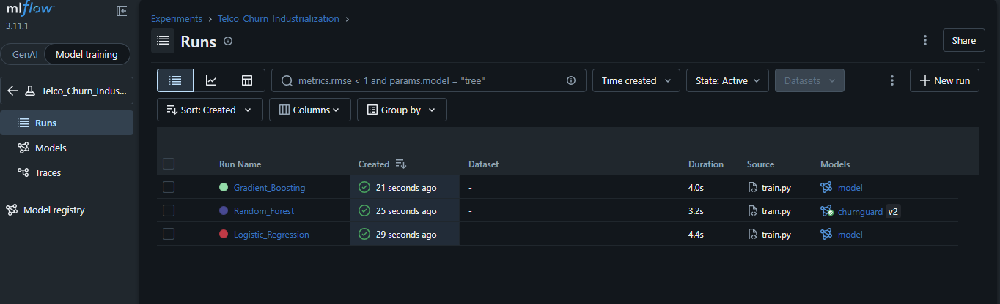
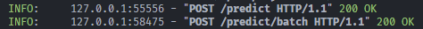
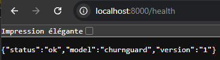
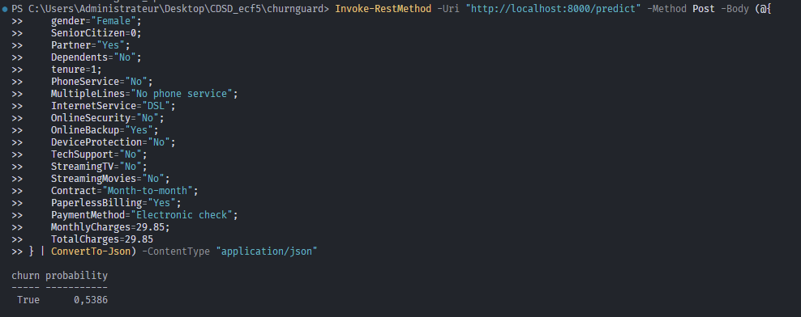
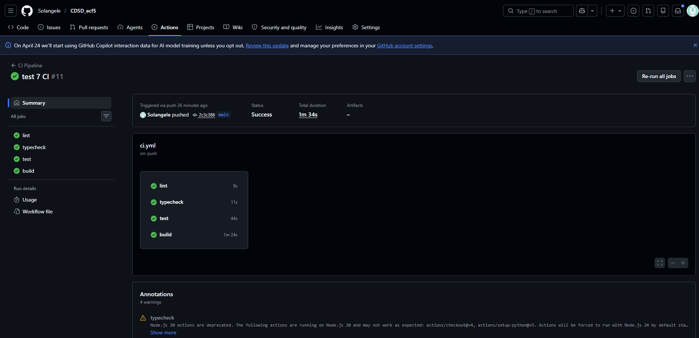
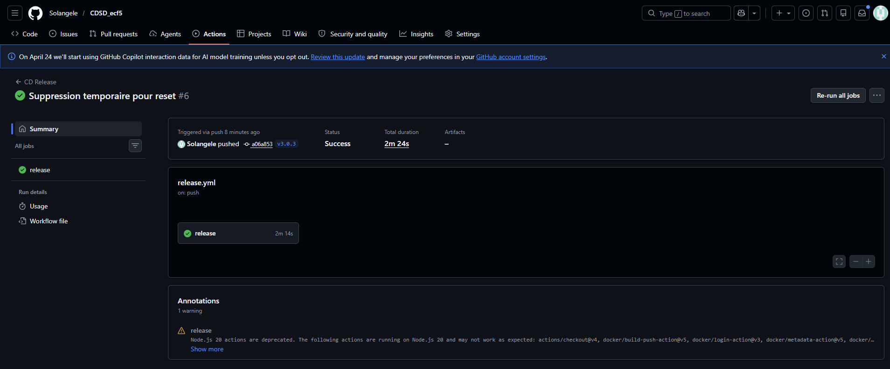
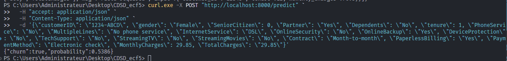

## Sujet
ChurnGuard MLOps
Industrialiser un modèle de prédiction de résiliation client
2 jours · individuel ·

Contexte fictif
Vous êtes consultant freelance, mandaté par TelcoFr, un opérateur de télécommunications français de 1,2 million de clients. La direction marketing a fait développer en interne un modèle de prédiction de résiliation (churn) — il fonctionne sur le poste de la data scientist qui l'a écrit, mais personne d'autre ne sait le faire tourner. Le notebook est un mille-feuille de cellules, le modèle est un fichier .pkl envoyé par mail, et chaque appel à la prédiction passe par un copier-coller dans Jupyter.
Votre mission : reprendre ce projet et l'amener au standard MLOps de l'entreprise. À la fin des deux jours, n'importe quel développeur doit pouvoir cloner le repo, faire `docker compose up`, et obtenir une API de prédiction fonctionnelle. La CI doit tourner sur chaque push, le modèle doit être versionné dans MLflow, et les tests doivent passer.


## Arborescence du projet

C:.
│   .coverage
│   .dockerignore
│   .gitignore
│   data.py
│   docker-compose.yml
│   Dockerfile
│   evaluate.py
│   image-1.png
│   image-2.png
│   image-3.png
│   image-4.png
│   image.png
│   README.md
│   requirements.txt
│   Sujet_ChurnGuard_MLOps.docx
│   train.py
│   __init__.py
│   
├───.github
│   └───workflows
│           ci.yml
│           release.yml
│           
├───.pytest_cache
│   │   .gitignore
│   │   CACHEDIR.TAG
│   │   README.md
│   │   
│   └───v
│       └───cache
│               lastfailed
│               nodeids
│               
├───.ruff_cache
│   │   .gitignore
│   │   CACHEDIR.TAG
│   │   
│   └───0.15.12
│           11222729837556386022
│           17026705928461734657
│           
├───api
│   │   main.py
│   │   __init__.py
│   │   
│   └───__pycache__
│           main.cpython-311.pyc
│           __init__.cpython-311.pyc
│           
├───data
│       telco_churn.csv
│       
├───mlflow_data
│   └───1
│       ├───2abb4178454c4a318fe3fbfe72e54330
│       │   └───artifacts
│       │       └───model
│       │               conda.yaml
│       │               input_example.json
│       │               MLmodel
│       │               model.pkl
│       │               python_env.yaml
│       │               registered_model_meta
│       │               requirements.txt
│       │               
│       ├───41caafe7dab14e35bde365899f9a5c28
│       │   └───artifacts
│       │       └───model
│       │               conda.yaml
│       │               input_example.json
│       │               MLmodel
│       │               model.pkl
│       │               python_env.yaml
│       │               requirements.txt
│       │               
│       └───def8244ad2944855a306c2bf0f038cf8
│           └───artifacts
│               └───model
│                       conda.yaml
│                       input_example.json
│                       MLmodel
│                       model.pkl
│                       python_env.yaml
│                       requirements.txt
│                       
├───mlruns
│       mlflow.db
│       
├───src
│       download_data.py
│       
├───tests
│   │   test_api.py
│   │   test_data.py
│   │   test_train.py
│   │   __init__.py
│   │   
│   └───__pycache__
│           test_data.cpython-311-pytest-9.0.3.pyc
│           test_train.cpython-311-pytest-9.0.3.pyc
│           __init__.cpython-311.pyc
│           
└───__pycache__
        data.cpython-311.pyc
        evaluate.cpython-311.pyc
        train.cpython-311.pyc
        __init__.cpython-311.pyc


## Résultat de la vérification des tests (1.3)

```bash
python -m pytest --cov=. tests/
================================================================================================ test session starts ================================================================================================
platform win32 -- Python 3.11.9, pytest-9.0.3, pluggy-1.6.0
rootdir: C:\Users\Administrateur\Desktop\CDSD_ecf5\churnguard
plugins: anyio-4.12.1, cov-7.1.0
collected 6 items                                                                                                                                                                                                    

tests\test_data.py ....                                                                                                                                                                                        [ 66%]
tests\test_train.py ..                                                                                                                                                                                         [100%]

================================================================================================== tests coverage ===================================================================================================
__________________________________________________________________________________ coverage: platform win32, python 3.11.9-final-0 __________________________________________________________________________________

Name                  Stmts   Miss  Cover
-----------------------------------------
__init__.py               0      0   100%
data.py                  11      0   100%
evaluate.py               7      0   100%
tests\__init__.py         0      0   100%
tests\test_data.py       23      0   100%
tests\test_train.py      24      0   100%
train.py                 12      0   100%
-----------------------------------------
TOTAL                    77      0   100%
================================================================================================= 6 passed in 3.88s =================================================================================================
```


## Création des 3 modèles



### Lancement des modèles avec MLflow et choix du meilleur



## API



## Dockerfile
```bash
# --- STAGE 1: Builder ---
FROM python:3.11-slim AS builder

WORKDIR /app

ENV PYTHONDONTWRITEBYTECODE=1
ENV PYTHONUNBUFFERED=1

RUN apt-get update && apt-get install -y --no-install-recommends \
    build-essential \
    && rm -rf /var/lib/apt/lists/*

RUN python -m venv /opt/venv
ENV PATH="/opt/venv/bin:$PATH"

COPY requirements.txt .
RUN pip install --no-cache-dir -r requirements.txt


# --- STAGE 2: Runtime ---
FROM python:3.11-slim AS runtime

WORKDIR /app

RUN apt-get update && apt-get install -y --no-install-recommends curl && rm -rf /var/lib/apt/lists/*

RUN adduser --disabled-password --gecos "" appuser

COPY --from=builder /opt/venv /opt/venv
ENV PATH="/opt/venv/bin:$PATH"

COPY . /app
COPY api/ ./api/

ENV PYTHONPATH="/app"

HEALTHCHECK --interval=30s --timeout=5s --start-period=5s --retries=3 \
    CMD curl -f http://localhost:8000/health || exit 1

RUN chown -R appuser:appuser /app
USER appuser

EXPOSE 8000

CMD ["uvicorn", "api.main:app", "--host", "0.0.0.0", "--port", "8000"]
```


## Docker compose
```bash
services:
  mlflow:
    image: ghcr.io/mlflow/mlflow:v2.11.3
    container_name: mlflow_server
    ports:
      - "5000:5000"
    volumes:
      - ./mlflow_data:/mlflow_data
      - ./mlruns:/app/mlruns
    working_dir: /app
    command: >
      mlflow server 
      --backend-store-uri sqlite:////app/mlruns/mlflow.db
      --default-artifact-root /mlflow_data
      --host 0.0.0.0
    networks:
      - churn_network

  api:
    build: .
    container_name: churnguard_api
    ports:
      - "8000:8000"
    volumes:
      - ./mlflow_data:/mlflow_data 
    environment:
      - MLFLOW_TRACKING_URI=http://mlflow:5000
    depends_on:
      - mlflow
    networks:
      - churn_network

networks:
  churn_network:
    driver: bridge
```

## Lancement de docker Api et MLflow 




## Partie CI



## Partie CD

https://github.com/Solangele/CDSD_ecf5/pkgs/container/churnguard


### Tester l'API (Démo)
Une fois l'image Docker lancée, vous pouvez tester la prédiction avec la commande suivante :

```bash
curl.exe -X POST "http://localhost:8000/predict" `
  -H "accept: application/json" `
  -H "Content-Type: application/json" `
  -d '{\"customerID\": \"1234-ABCD\", \"gender\": \"Female\", \"SeniorCitizen\": 0, \"Partner\": \"Yes\", \"Dependents\": \"No\", \"tenure\": 1, \"PhoneService\": \"No\", \"MultipleLines\": \"No phone service\", \"InternetService\": \"DSL\", \"OnlineSecurity\": \"No\", \"OnlineBackup\": \"Yes\", \"DeviceProtection\": \"No\", \"TechSupport\": \"No\", \"StreamingTV\": \"No\", \"StreamingMovies\": \"No\", \"Contract\": \"Month-to-month\", \"PaperlessBilling\": \"Yes\", \"PaymentMethod\": \"Electronic check\", \"MonthlyCharges\": 29.85, \"TotalCharges\": \"29.85\"}'
```



## Bonus
Je suis désolée, je n'ai pas fait les bonus. J'ai fais une erreur dans mon arborescence dès le début du projet, ce qui a entraîné des soucis pour le fonctionnement de CI/CD. 
J'ai changé l'arborescence, mais cela m'a obligé a refaire en partie le projet parce que plus rien ne fonctionnait. J'ai perdu 4 heures dessus. 
Je préfère rendre quelque chose que je pense propre et fonctionnel plutot que de me lancer dans les bonus qui risquent de m'obliger à rendre un produit non terminé. 


